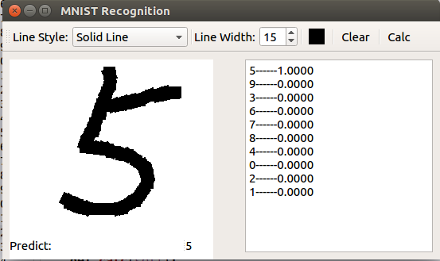
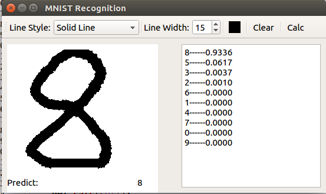

#MNIST Recognition

###Implement mnist recognition by pytorch and pyqt5
A simple project for mnist recognition which support real-time handwriting.

###Requirments
* pytorch  0.2.0
* torchvision 0.1.9
* pyqt5 5.9
* numpy 1.13
* matplotlib  2.1.0
* pillow 4.3.0

###Use It
Painti digits in the drawing board and click 'clac' button to see the result.

These are some tests

